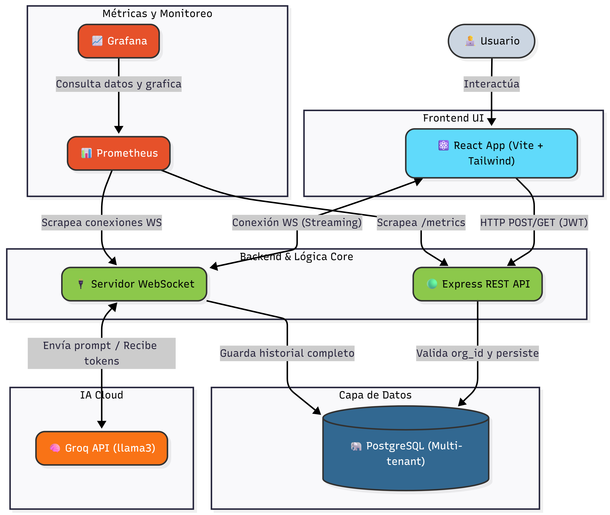

# Conversa Insights Dashboard

Este es un panel de control avanzado para monitorizar, analizar y visualizar las interacciones de los usuarios con agentes de inteligencia artificial en tiempo real. 

Esta herramienta esta pensada especialmente para los equipos de Customer Success y Product Ops, ayudandolos a tomar decisiones basadas en datos reales sobre el volumen y la calidad de las conversaciones.

## Run del proyecto local

### Requisitos
* Docker y Docker Compose
* Node.js en su version 20 o superior

### Pasos a seguir
1. Clona el repositorio:
   `git clone https://github.com/JFeliu01/test-versu.git`
2. Añade tu API Key:
   Crea un archivo `.env` en la carpeta principal y pega tu clave de Groq:
   `AI_API_KEY=tu_clave_aqui`
3. Levanta los servicios (Base de datos, Backend y Analiticas):
   `docker-compose up -d --build`
4. Inicia la interfaz visual:
   `cd frontend && npm install && npm run dev`

Credenciales de prueba para el sistema Multi-tenancy:
* Organizacion Retail: `admin@orga.com` con la clave `123456`
* Organizacion SaaS: `admin@orgb.com` con la clave `123456`

## Decisiones de Arquitectura

* Multi-tenancy a nivel de fila: Extraemos el identificador de la organizacion directamente del token JWT en cada peticion. El backend se encarga de filtrar la informacion en la base de datos de manera segura, lo que garantiza un aislamiento total de la informacion entre clientes.

* Streaming Optimizado: Utilizamos WebSockets puros en Node.js. El modelo de inteligencia artificial envia los fragmentos de texto al backend, y este los pasa directamente al frontend. Solo guardamos el mensaje en PostgreSQL cuando el flujo termina, lo que reduce mucho la carga en la base de datos.
* Memoria de chat: Para simular memoria conversacional, el backend recupera todo el historial de la conversacion actual desde la base de datos y lo incluye de forma transparente antes de pedir una nueva respuesta a la inteligencia artificial.
* Auto Provisionamiento: El contenedor de Grafana arranca con sus fuentes de datos y paneles totalmente configurados usando volumenes, asi no tienes que configurar nada de forma manual.

## Herramientas de Inteligencia Artificial Usadas
Utilizamos Groq con el modelo `llama-3.1-8b-instant`. Inicialmente usabamos una version anterior pero tuvimos que migrar a esta porque la otra fue descontinuada. Elegimos Groq por su increible baja latencia, lo cual hace que el frontend se sienta instantaneo mientras transmite el texto palabra por palabra.

Para realizar el código, se planeó con gemini 3.1 pro y el editor de código fue el de antigravity, utilizando como modelo Claude Opus 4.6

## Mejoras de Interfaz e Implementaciones Recientes
1. Personalidades a medida: En la vista de configuraciones agregamos descripciones mas humanas y detalladas para el agente. Arreglamos un detalle visual para que puedas leer las descripciones completas sin que se recorten. Estas preferencias se envian de forma fluida al backend mediante WebSocket.

2. Interfaz reactiva: El chat ahora hace scroll de forma automatica mientras la inteligencia artificial escribe. Tambien resolvimos un problema con los graficos en el panel principal para que encajen perfectamente en su contenedor sin desbordarse visualmente. Por ultimo, logramos que las estrellas de calificacion se iluminen correctamente de acuerdo al puntaje que le hayas dado a una conversacion.

3. Correccion de estado y red: Arreglamos un error que duplicaba las conexiones de WebSockets, lo que causaba que la aplicacion recibiera mensajes dobles. Tambien incorporamos la carga inicial de conversaciones, lo que te permite ver tu historial tan pronto como entras a la pagina de chats.

## Alcance del Proyecto
* Conexion a una API de inteligencia artificial real con streaming por WebSockets y memoria historica recuperada desde la base de datos.

* Implementacion de Multi-tenancy con autenticacion por JWT.
* Creacion de una interfaz responsiva y amigable.
* Uso de Terraform para provisionar la infraestructura.
* Automatizacion a traves de canales de CI.
* Observabilidad en funcionamiento gracias a Grafana y Prometheus.

### Faltantes para el producto final
* Correr el código en un IaaS como AWS (Existe el terraform, pero el tier gratuito de AWS no cubre la base de datos que requiere el proyecto).

